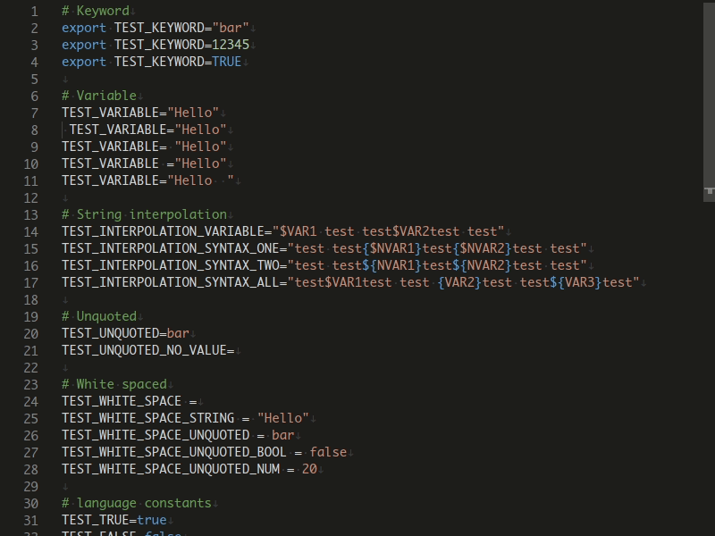
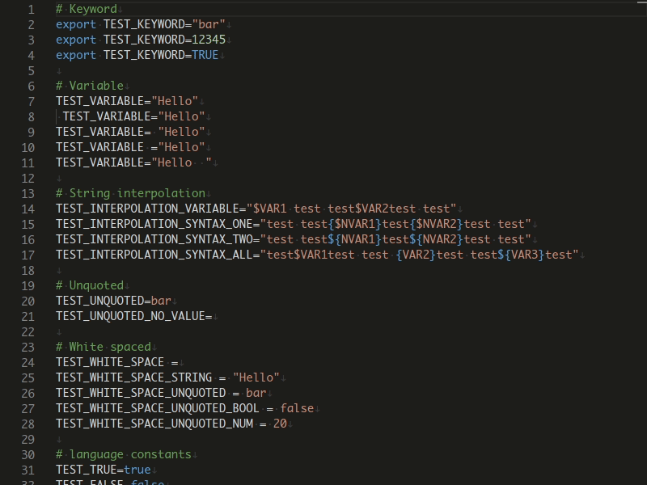
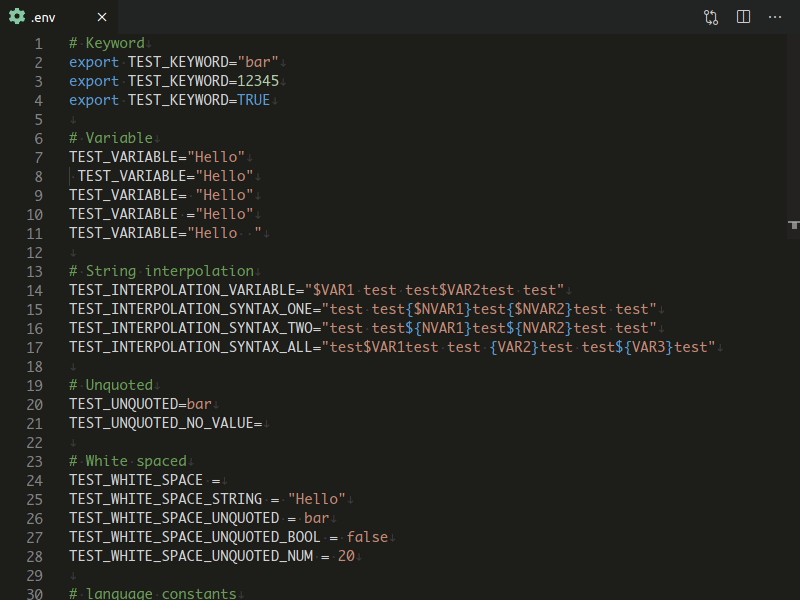

# ENV

Adds formatting and syntax highlighting support for env files (`.env`) to Visual Studio Code  

## Features

- Syntax highlighting

  

- Folding

  The extension will enable folding on file content that are wrapped with the following pattern:

  ```text
  # ...       << begin with comment(s)
  ...
  ...         << folded content
  ...
              << end with a blank line
  ```

  

- Formatting

  Use the `Format Document` command (<kbd>CTRL</kbd>+<kbd>SHIFT</kbd>+<kbd>I</kbd>) from the `Command Pallete` (<kbd>CTRL</kbd>+<kbd>SHIFT</kbd>+<kbd>P</kbd>) to format the current env file  

  

## Custom env file extension

The extension support env files with the following extensions:

- `.env`
- `.env.sample`
- `.env.example`

To enable support for other env files with specific naming convention/ file extension, use the `files.associations` settings in Visual Studio Code.

For example, the following settings will enable support for `.env.development` and `.env.production` files:

```json
  "files.associations": {
    ".env.development": "env",
    ".env.production": "env"
  }
```

## Acknowledgements

- [Mike Stead](https://github.com/mikestead) for [dotenv extension for vscode](https://github.com/mikestead/vscode-dotenv)  

## License

This project is licensed under the terms of the [MIT license](LICENSE).
