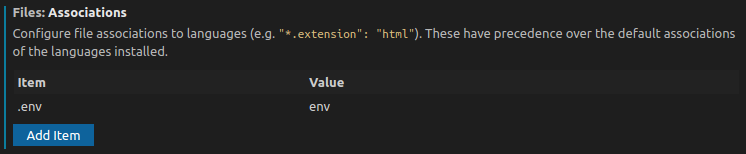

# ENV


Adds formatting and syntax highlighting support for env files (`.env`) to Visual Studio Code  

## Features

- Syntax highlighting

  

- Folding

  The extension will enable folding on file content that are wrapped with the following pattern:

  ```text
  # ...       << begin with comment(s)
  ...
  ...         << folded content
  ...
              << end with a blank line
  ```

  

- Formatting

  Use the `Format Document` command (<kbd>CTRL</kbd>+<kbd>SHIFT</kbd>+<kbd>I</kbd>) from the `Command Pallete` (<kbd>CTRL</kbd>+<kbd>SHIFT</kbd>+<kbd>P</kbd>) to format the current env file  

  

## Custom env file extension

The extension support env files with the following name:

- `.env`
- `.env.sample`
- `.env.example`

To enable support for other env files with specific naming convention/ file extension, use the `files.associations` settings in Visual Studio Code.

For example, the following settings will enable support for `*.env.development` and `*.env.production` files:

```json
  "files.associations": {
    "*.env.development": "env",
    "*.env.production": "env"
  }
```

## Known Issues

- Highlighting/ Formatting/ Folding doesn't work

  Other extensions (like [shell-format](https://marketplace.visualstudio.com/items?itemName=foxundermoon.shell-format)) could also provides contributions to env files (`.env`). When two or more extensions providing contributions to a same file, there's a chance the contributions of previous extension will be overwritten by the later (see: [github.com/microsoft/vscode-docs/issues/2862](https://github.com/microsoft/vscode-docs/issues/2862#issuecomment-599994967)).

  To workaround this issue, use Visual Studio Code `files.associations` to force the language of `.env` files to be always specified as `env`:

  

  Other non permanent solution is by using the `Select Language Mode` button on the Visual Studio Code status bar and set the language to `Environment Variables` (alias of `env`) on the opened file:

  


## Acknowledgements

- [Mike Stead](https://github.com/mikestead) for [dotenv extension for vscode](https://github.com/mikestead/vscode-dotenv)  

## License

This project is licensed under the terms of the [MIT license](LICENSE).
